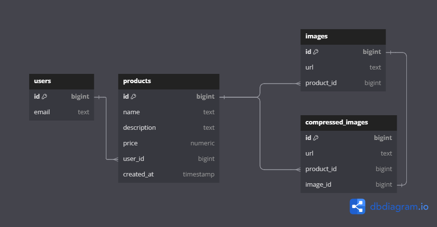
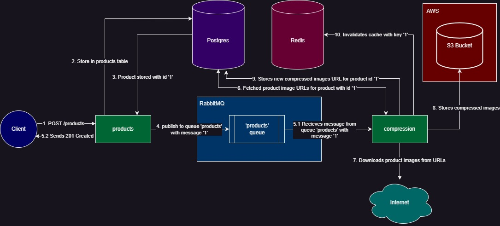
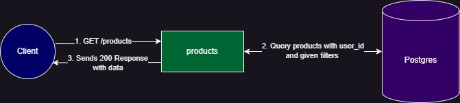
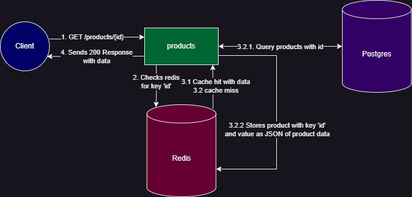

# Product Management Backend

## Setup

**PREREQUISITES: DOCKER**

-   Create an S3 Bucket on AWS
-   Create [Access keys on AWS](https://docs.aws.amazon.com/keyspaces/latest/devguide/create.keypair.html)
-   Open `docker-compose.yml` file
    -   Define `AWS_ACCESS_KEY_ID` (Line 76) with your AWS Access Key ID
    -   Define `AWS_SECRET_ACCESS_KEY` (Line 77) with your AWS Secret Access Key
    -   Define `AWS_BUCKET_REGION` (Line 78) with the region of your AWS Bucket
    -   Define `S3_BUCKET_NAME` (Line 79) with your AWS S3 Bucket name
-   Build images using `docker-compose build`
-   Run the server using `docker-compose up`
-   Test the application on `http://localhost:8000`

## Architecture

### Database Design



### API Design

-   **`POST /products`:** - Accepts `application/json` - Required data: - `user_id`: Must be a valid user ID - `product_name`, `product_description`, `product_price` - `product_images`: Array of URL Strings
    
-   **`GET /products`:** - Required query parameter - `user_id`: User's who products needs to be fetched. Must be a valid user ID - Optional query parameter - `min_price`, `max_price`, `product_name` for additional filtering
    
-   **`GET /products/{id}`:** Get product by id (implements Redis caching)
    

### Benchmarking Results

Benchmarking script available at **benchmarks/benchmarks.go**

```
Starting Benchmarking of GET /products/{id} Endpoint

Creating New Products for Benchmarking Without Cache...
Created 1000 new products in 7.4142415s

Benchmarking WITH Cache (repeated requests to the same product ID)...
Results WITH Cache:
Total Requests: 1000
Successful: 1000
Failed: 0
Total Time: 924.7214ms
Requests per Second: 1081.41

Phase 3: Benchmarking WITHOUT Cache (unique requests to different product IDs)...
Results WITHOUT Cache:
Total Requests: 1000
Successful: 1000
Failed: 0
Total Time: 4.2068929s
Requests per Second: 237.71

Benchmarking Completed.
With Cache - Total Time: 924.7214ms, RPS: 1081.41
Without Cache - Total Time: 4.2068929s, RPS: 237.71
```
